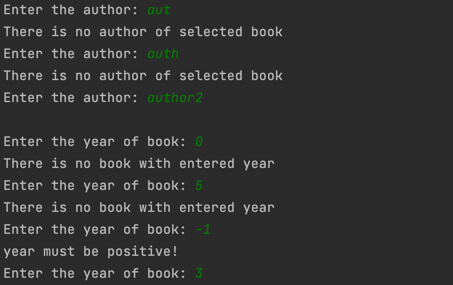
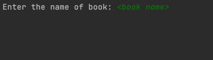
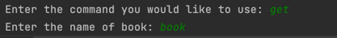

# Library

## Interface
#### Getting book
- it was decided that it would be better to separate the additional input information about the book you want to get through an empty line, because some errors are possible when entering data, and then it will be easier for you to navigate through the entered data.

If you have another opinion about this feature, please contact me and offer your interface.

## Features
- if the library is not empty, but you want to fill it with generated books, then library will be empty out and will fill with new generated books.

## Input/Output/Menu
#### Reading content not from console
To read not only from console or for instance from file, telegram bot, database you need to make your class handler IOHandler which located in src/main/java/library/stream
#### Writing content not to console
To write not only to console or for instance to file, telegram bot, database you need to make your class handler IOHandler which located in src/main/java/library/stream
#### Creating menu not in console
To create not only console menu or for instance file, telegram bot, database menus you need to implement LibMenu interface which located in src/main/java/library/menu package
## Data formats
#### put
- When you put book it must be in format "title=\<title>, author=\<author>" and can contains additional data: "year=\<year>, description=\<description>"
- Order of fields is not important
#### year
- Year should be an integer type and greater or equal 0
- Year can be parsed from string
#### making request
1. You need to enter the command from available commands

2. You need to enter your request

- In result, using the example of the get command , it turns out like this

## Available commands
- get - will get the needful book from library
- put - will put the needful book to library
- list - will print list of your books
- all - will print all books in library

## In development or in ideas
- Database with library users
- FileHandler
- DatabaseHandler
- Getting several books
- Do interactive menu
- Make program instruction by available commands
- Make available to enter the command with request in one line
- Make all program methods possible to handle all types of requests.
- Make an indication that the field cannot be empty
- Parsing of command